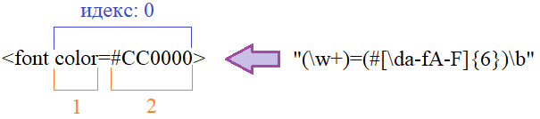
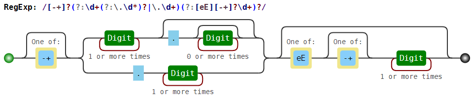

# RegExp

>Сайт для проверки: [regex101.com](https://regex101.com/)<br />
>Визуализация регулярок: [www.debuggex.com](https://www.debuggex.com/)

>Неплохой курс Python 3 [регулярные выражения](https://www.youtube.com/watch?v=1SWGdyVwN3E&list=PLA0M1Bcd0w8w8gtWzf9YkfAxFCgDb09pA)<br />
>[Сайт курса](https://proproprogs.ru/modules/literaly-i-simvolnyy-klass)

>[Статья](https://habr.com/ru/post/349860/) на Хабр

## Один символ

`.` - любой одиночный символ (кроме `\n`)

`\d` - любая цифра

`\D` - всё, кроме цифр

`\s` - любой пробельный символ (`" ", \t, \n, \r, \f, \v`) `[ \t\n\r\f\v]`

`\S` - любой не пробельный символ `[^ \t\n\r\f\v]`

`\w` - буква (любая буква, цифра или символ нижнего подчёркивания)

`\W` - всё, кроме букв

`[]` - любой из символов в скобках, диапазон, набор символов (экранировать только `]` и `\`)

`[^]` - любой символ, кроме перечисленных после `^`

`[-0-9]` - если нужен знак `-`, его нужно ставить первым

`\b` - граница слова (не ищется в строке текста, а только определяет границу слова)

`\B` - не граница

`\` - экранирование

`\n` и `\t` - тоже используются


## Квантификаторы (количество повторений)

`{n}` - n повторений, короткая запись, эквивалент `{n,n}`

`{m,n}` - от m до n повторений включительно

`{m,}` - не менее m повторений

`{,n}` - не более n повторений

`{m,}?` и `{,n}?` - тоже можно

`?` или `{0,1}` - 0 или 1 вхождение (минорный: `??`)

`*` или `{0,}` - 0 и более (минорный: `*?`)

`+` или `{1,}` - 1 и более (минорный: `+?`)

`{m,n}?` - минорный (ленивый) режим, захватывает минимальное число символов (по умолчанию, без ? - все жадные, захватывают максимально возможное число символов)

пример: `[-+]?` — либо -, либо +, либо пусто


****

`()` - группирующие сохраняющие скобки

`\i` - обращение к сохранению (i - натуральное число: 1, 2, 3, ...)

`(?P<name>...)` - имя сохраняющей скобки (<> - нужны) (вместо ... - выражение)

`(?P=name)` - обращаемся к сохраняющей скобке (<> - не нужны)

`(?P<q>[\'''])` `(?(id|name)yes_pattern)` или `(?(id|name)yes_pattern|no_pattern)` - yes-pattern - шаблон, выполняемый при наличии группы; no_pattern – при отсутствии

`$` - конец строки (с флагом `re.MULTILINE` – позиция перед символом переноса строки `\n`)

`^` - начало строки (с флагом `re.MULTILINE` – начало строки)

`\A` - начало текста

`\Z` - конец текста

`(?=exp)` - Проверка на совпадение с выражением exp продолжения строки. При этом позиция поиска не смещается на выражение exp (опережающая проверка) (exp - выражение или шаблон)

`(?!exp)` - Проверка на несовпадение с выражением exp продолжения строки. (Также опережающая проверка)

`(?<=exp)` - Проверка на совпадение с выражением exp хвоста уже обработанной (проверенной) строки. Она также называется *позитивной ретроспективной проверкой*

`(?<!exp)` - Проверка на несовпадение с выражением exp хвоста уже обработанной (проверенной) строки. Еще она называется *негативной ретроспективной проверкой*

****


## Флаги

> можно записывать через `|`, например `re.MULTILINE|re.VERBOSE`

`re.A` или `re.ASCII` - проверки \b, \B, \s, \S, \w и \W действуют так, как если бы они применялись к тексту, содержащему только символы ASCII **(по умолчанию используется Юникод** `re.U` / ``re.UNICODE` **лучше оставаться в этом режиме)**

`re.I` или `re.IGNORECASE` - без учета регистра символов

`re.M` или `re.MULTILINE` - влияет на проверки `^` и `$`. Начало `^` считается началом строки (сразу после символа `\n` или начало текста). Конец `$` считается в позиции перед `\n` (или конец строки)

`re.S` или `re.DOTALL` - символ `.` также включает символ перевода строки `\n`.

`re.X` или `re.VERBOSE` - позволяет включать в регулярные выражения пробелы и комментарии

`re.DEBUG` - ключает режим отладки при компиляции регулярного выражения

### Флаги внутри выражения

`(?flags)` - flags - один или несколько флагов

например: `re.findall(r"(?im)python", text)`

`a` – то же самое, что и `re.ASCII`<br />
`i` – соответствует `re.IGNORECASE`<br />
`m` – для `re.MULTILINE`<br />
`s` – для `re.DOTALL`<br />
`x` – для `re.VERBOSE`

## Методы re в Python 3

`re.search(pattern, string, flags)` – ищет **первое вхождение**

`re.finditer(pattern, string, flags)` – ищет **все непересекающиеся** вхождения, возвращает match-объект

`re.findall(pattern, string, flags)` – **все непересекающиеся** вхождения

`re.match(pattern, string, flags)` – ищет вхождение **с начала строки**

`re.fullmatch(pattern, string, flags)` – подходит ли строка string целиком под шаблон pattern

`re.split(pattern, string, flags)` – разбивка строки по шаблону (аналог str.split())

`re.sub(pattern, repl, string, count, flags)` – заменяет в строке `string` найденые совпадения строкой или функцией `repl`, `count` раз

`re.subn(pattern, repl, string, count, flags)` – заменяет в строке `string` найденые совпадения строкой или функцией `repl`, `count` раз и возвращает число произведённых замен

`re.compile(pattern, flags)` – компилирует регулярное выражение и возвращает его в виде экземпляра класса Pattern (для многократного использования шаблона)

## Объект re.Match



`match.group(n)` – сохраняющая группа (n - номер группы)

`match.groups()` – все группы

`match.lastindex()` – индекс последней сохраняющей группы

`match.start(n)` – начальный индекс группы n в тексте

`match.end(n)` – конечный индекс группы n в тексте

`match.span(n)` – кортеж начальной и конечной позиции группы n в тексте

`match.pos` – начальный индекс в тексте, с которого производился поиск

`match.endpos` – конечная позиция в тексте, до которой производился поиск

`match.re` – возвращает скомпилированный шаблон

`match.string` – возвращает анализируемую строку

`match.groupdict()` – возвращает словарь, который содержит имена групп и их значения<br />(например: `{'key': 'color', 'value': '#CC0000'}`)

`match.lastgroup` – возвращает имя последней группы или None, если групп нет

`match.expand(строка)` – формирует строку с использованием сохранённых групп

Например: `match.expand(r"\g<key>:\g<value>")`, где:

* `\g<name>` – обращение к группе по имени;
* `\1, \2, …` – по номеру.

## Примеры

Все примеры будут **на Python**

Ищем **набор символов** в строке:

``` Python3
import re

text = "Карта map и объект bitmap - это разные вещи"

match = re.findall("map", text)
print(match)  # ['map', 'map']
```

Ищем **целое слово** в той же строке (*см. выше*):

``` Python3
match = re.findall(r"\bmap\b", text)
print(match)  # ['map']
```

**Экранируем символы** скобок:

``` Python3
import re

text = "map и (map) - это разные вещи"

match = re.findall(r"\(map\)", text)
print(match)  # ['(map)']
```

Используем **набор символов []**:

``` Python3
import re

text = "Еда, беду, победа"

match = re.findall(r"[еЕ]д[ау]", text)
print(match)  # ['Еда', 'еду', 'еда']
```

**Диапазон символов** (*см. выше*):

``` Python3
import re


text_1 = "Еда, беду, 55 победа"

match_1 = re.findall(r"[0123456789]", text_1)  # [] - каждый раз всего один из ...
print(match_1)  # ['5', '5']


text_2 = "Еда, беду, 5 55 победа"

# [0-9][0-9] - то же, что и: [0123456789][0123456789]
match_2 = re.findall(r"[0-9][0-9]", text_2)  # [][] - ищет 2 символа
print(match_2)  # ['55']


text_3 = "Еда, беду, -5 55 победа"

# [-0-9] - минус или цифра
match_3 = re.findall(r"[-0-9][0-9]", text_3)
print(match_3)  # ['-5', '55']


text_4 = "Еда, -5 55"

# [^0-9] - не цифра
match_4 = re.findall(r"[^0-9]", text_4)
print(match_4)  # ['Е', 'д', 'а', ',', ' ', '-', ' ']
```

Для **шестнадцатеричных чисел**:

``` Python3
import re

text = "0xf, 0xa, 0x5"

match = re.findall(r"0x[\da-fA-F]", text)
print(match)  # ['0xf', '0xa', '0x5']
```

**Квантификаторы {}**:

``` Python3
import re

text = "Google, Gooogle, Goooooogle"  # 'o' - 2, 3, 6

# мажорный
match1 = re.findall(r"o{2,5}", text)
print(match1)  # ['oo', 'ooo', 'ooooo'] ('o' - 2, 3, 5)


# минорный
match2 = re.findall(r"o{2,5}?", text)
print(match2)  # ['oo', 'oo', 'oo', 'oo', 'oo'] (по одной паре из 1 и 2 слова и 3 пары из 3-го)
```

Простая проверка номера телефона:

``` Python3
import re

phone = "89123456789"

match = re.findall(r"8\d{10}", phone)
print(match)  # ['89123456789']
```

Необязательная буква:

``` Python3
import re

text = "стеклянный, стекляный"

match = re.findall(r"стеклянн?ый", text)  # вторая 'н' - не обязательна
print(match)  # ['стеклянный', 'стекляный']
```

Разобрать по ключам и значениям:

``` Python3
import re

text = "author=Пушкин А.С.; title = Евгений Онегин; price =200; year= 2001"

match_1 = re.findall(r"\w+\s*=\s*[^;]+", text)
print(match_1)  # ['author=Пушкин А.С.', 'title = Евгений Онегин', 'price =200', 'year= 2001']


match_2 = re.findall(r"(\w+)\s*=\s*([^;]+)", text)
print(match_2)  # [('author', 'Пушкин А.С.'), ('title', 'Евгений Онегин'), ('price', '200'), ('year', '2001')]
```

**Минорный квантификатор**:

``` Python3
import re

text = "<p>Картинка  в тексте</p>"

# мажорный
match_1 = re.findall(r"", text)
print(match_1)  # [" в тексте</p>"]

# минорный
match_2 = re.findall(r"", text)
print(match_2)  # [""]

# мажорный аналог минорного
match_3 = re.findall(r"]*>", text)
print(match_3)  # [""]
```

Более правильный вариант, который учитывает наличие `src` (*см. выше*):

``` Python3
import re

text_1 = "<p>Картинка  в тексте</p>"
text_2 = "<p>Картинка  в тексте</p>"
text_3 = "<p>Картинка  в тексте</p>"

match_1 = re.findall(r"]*?src\s*[^>]+>", text_1)
print(match_1)  # []

match_2 = re.findall(r"]*?src\s*[^>]+>", text_2)
print(match_2)  # [""]

match_3 = re.findall(r"]*?src\s*[^>]+>", text_3)
print(match_3)  # [""]
```

Ищем **определённые ключи**:

``` Python3
import re

text = "lat = 5, lon=7"

match = re.findall(r"lat\s*=\s*\d+|lon\s*=\s*\d+", text)
print(match)  # ['lat = 5', 'lon=7']


text = "pi=3, a = 5"

match = re.findall(r"lat\s*=\s*\d+|lon\s*=\s*\d+", text)
print(match)  # []
```

**Группирующие скобки** *(оптимизируем код, см. выше)*:

``` Python3
import re

text = "lat = 5, lon=7, a=5"

# несохраняющая группирующая скобка (?:)
match = re.findall(r"(?:lat|lon)\s*=\s*\d+", text)
print(match)  # ['lat = 5', 'lon=7']


# сохраняющая группировка
match = re.findall(r"(lat|lon)\s*=\s*\d+", text)
print(match)  # ['lat', 'lon']  - 2-й уровень


# сохраняющая группировка
match = re.findall(r"((lat|lon)\s*=\s*\d+)", text)
print(match)  # [('lat = 5', 'lat'), ('lon=7', 'lon')]  - оба уровня


# сохраняем значения отдельно
match = re.findall(r"(lat|lon)\s*=\s*(\d+)", text)
print(match)  # [('lat', '5'), ('lon', '7')]
```

Достаём **путь к файлу** из тега \:

``` Python3
import re

text = "<p>Картинка  в тексте</p>"

match = re.findall(r"]*src=[\"'](.+?)[\"']", text)
print(match)  # ['bg.jpg']

# \ в конце пути
text = "<p>Картинка  в тексте</p>"

match = re.findall(r"]*src=([\"'])(.+?)\1", text)  # \1 == ([\"']) (первые сохраняющие скобки, 1 - индекс)
print(match)  # [("'", 'bg.jpg')]
```

**Парсим XML-файл** ([папка проекта](parse_xml)):

``` Python3
import re

with open("map.xml", "r") as f:
    lat = []
    lon = []
    for text in f:
        match = re.search(r"<point\s+[^>]*?lon=([\"\'])(?P<lon>[0-9.,]+)\1\s+[^>]*lat=([\"\'])(?P<lat>[0-9.,]+)\1",
                          text)
        if match:
            v = match.groupdict()
            if "lon" in v and "lat" in v:
                lon.append(v["lon"])
                lat.append(v["lat"])

    print(lon, lat, sep="\n")
```

### Проверки

**Слово целиком** `\b`:

``` Python3
import re
 
text = "подоходный налог"

match = re.findall(r"прибыль|обретение|\bдоход\b", text)
print(match)  # []
```

**Группа** (каждое слова целиком) `\b()\b`:

``` Python3
import re
 
text = "подоходный налог, доход"

match = re.findall(r"\b(прибыль|обретение|доход)\b", text)
print(match)  # ['доход'] - только "доход" целиком
```

Весь **текст между** тегами `<script></script>`:

``` Python3
import re

text = """<!DOCTYPE html>
<html>
<head>
<meta http-equiv="Content-Type" content="text/html; charset=windows-1251">
<meta name="viewport" content="width=device-width, initial-scale=1.0">
<title>Уроки по Python</title>
</head>
<body>
<script type="text/javascript">
let o = document.getElementById('id_div');
console.log(obj);
</script>
</body>
</html>"""

match = re.findall(r"^<script.*?>([\w\W]+)(?=</script>)", text, re.MULTILINE)

print(match)  # ["\nlet o = document.getElementById('id_div');\nconsole.log(obj);\n"]
```

Опережающая проверка (*text из примера выше*):

```
match = re.findall(r"^<script.*?>([\w\W]+)(?<=</script>)", text, re.MULTILINE)

print(match)  # ["\nlet o = document.getElementById('id_div');\nconsole.log(obj);\n</script>"]  - </script> в конце
```

**Ретроспективная проверка:** достаём все пары ключ="значение" (*text из примера выше*):

``` Python3
match = re.findall(r"([-\w]+)[ \t]*=[ \t]*[\"']([^\"']+)(?<![ \t])", text, re.MULTILINE)  # (?<![ \t]) - если перед кавычкой будет пробел, уберёт

print(match)  # [('http-equiv', 'Content-Type'), ('content', 'text/html; charset=windows-1251'), ('name', 'viewport'), ('content', 'width=device-width, initial-scale=1.0'), ('type', 'text/javascript')]
```

**Ретроспективная проверка:** достаём все пары ключ="значение" или ключ=значение (*text из примера выше*):

``` Python3
import re

text = """<!DOCTYPE html>
<html>
<head>
<meta http-equiv="Content-Type" content="text/html; charset=windows-1251">
<meta name="viewport" content="width=device-width, initial-scale=1.0">
<title>Уроки по Python</title>
</head>
<body>
<p align=center>Hello World!</p>
</body>
</html>"""

match = re.findall(r"([-\w]+)[ \t]*=[ \t]*(?P<q>[\"'])?(?(q)([^\"']+(?<![ \t]))|([^ \t>]+))", text, re.MULTILINE)

print(match)  # [('http-equiv', '"', 'Content-Type', ''), ('content', '"', 'text/html; charset=windows-1251', ''), ('name', '"', 'viewport', ''), ('content', '"', 'width=device-width, initial-scale=1.0', ''), ('align', '', '', 'center')]
```

Комментарии, пробелы `re.VERBOSE` (*text из примера выше*):

```
match = re.findall(r"""([-\w]+)             #выделяем атрибут
                   [ \t]*=[ \t]*            #далее, должно идти равно и кавычки
                   (?P<q>[\"'])?            #проверяем наличие кавычки
                   (?(q)([^\"']+(?<![ \t]))|([^ \t>]+))     #выделяем значение атрибута
                   """, 
                   text, re.MULTILINE|re.VERBOSE)

print(match)  # результат см. выше
```

**Флаги внутри выражения**:

```
import re

text = "Python, python, PYTHON"

match = re.findall(r"(?im)python", text)  # m - только для примера

print(match)  # ['Python', 'python', 'PYTHON']
```

**Match.Expand()**:

``` Python3
import re

text = "<font color=#CC0000>"

match = re.search(r"(?P<key>\w+)=(?P<value>#[\da-fA-F]{6})\b", text)
match.expand(r"\g<key>:\g<value>")  # вернёт: 'color:#CC0000'
```

**re.search()**:

``` Python3
import re

text = "<font color=#CC0000 bg=#ffffff>"

match = re.search(r"(?P<key>\w+)=(?P<value>#[\da-fA-F]{6})\b", text)
match.groups()  # ('color', '#CC0000')
```

**re.finditer()**:

``` Python3
import re
 
text = "<font color=#CC0000 bg=#ffffff>"

for m in re.finditer(r"(?P<key>\w+)=(?P<value>#[\da-fA-F]{6})\b", text):
	print(m.groups())

# ('color', '#CC0000')
# ('bg', '#ffffff')
```

**re.findall()**:

``` Python3
import re

text = "<font color=#CC0000 bg=#ffffff>"

match = re.findall(r"(?P<key>\w+)=(?P<value>#[\da-fA-F]{6})\b", text)
print(match)  # [('color', '#CC0000'), ('bg', '#ffffff')]
```

**re.match()**:

``` Python3
import re

text = "+7(123)456-78-90"

m = re.match(r"\+7\(\d{3}\)\d{3}-\d{2}-\d{2}", text)
print(m)  # <re.Match object; span=(0, 16), match='+7(123)456-78-90'>
```

**re.split()**:

``` Python3
import re

text = """<point lon="40.8482" lat="52.6274" />
<point lon="40.8559" lat="52.6361" />; <point lon="40.8614" lat="52.651" />
<point lon="40.8676" lat="52.6585" />, <point lon="40.8672" lat="52.6626" />
"""

ar = re.split(r"[\n;,]+", text)  # список строк разделённых '\n', ';' или ','
print(ar)

# ['<point lon="40.8482" lat="52.6274" />', '<point lon="40.8559" lat="52.6361" />', ' <point lon="40.8614" lat="52.651" />', '<point lon="40.8676" lat="52.6585" />', ' <point lon="40.8672" lat="52.6626" />', '']
```

**re.sub()** со строкой:

``` Python3
import re

text = """Москва
Казань
Тверь
Самара
Уфа"""

list = re.sub(r"\s*(\w+)\s*", r"<option>\1</option>\n", text)
print(list)

# <option>Москва</option>
# <option>Казань</option>
# <option>Тверь</option>
# <option>Самара</option>
# <option>Уфа</option>
```

**re.sub()** с функцией:

``` Python3
import re

text = """Москва
Казань
Тверь
Самара
Уфа"""

count = 0
def replFind(m):  # m - объект Match
	global count
	count += 1
	return f"<option value='{count}'>{m.group(1)}</option>\n"


list = re.sub(r"\s*(\w+)\s*", replFind, text)
print(list)

# <option value='1'>Москва</option>
# <option value='2'>Казань</option>
# <option value='3'>Тверь</option>
# <option value='4'>Самара</option>
# <option value='5'>Уфа</option>
```

**re.subn()**:

``` Python3
import re

text = """Москва
Казань
Тверь
Самара
Уфа"""

list, total = re.subn(r"\s*(\w+)\s*", r"<option>\1</option>\n", text)
print(list, total)

# <option>Москва</option>
# <option>Казань</option>
# <option>Тверь</option>
# <option>Самара</option>
# <option>Уфа</option>
# 5
```

**re.compile()**:

``` Python3
import re
 
text = """Москва
Казань
Тверь
Самара
Уфа"""

count = 0
def replFind(m):
    global count
    count += 1
    return f"<option value='{count}'>{m.group(1)}</option>\n"

rx = re.compile(r"\s*(\w+)\s*")
list, total = rx.subn(r"<option>\1</option>\n", text)
list2 = rx.sub(replFind, text)
print(list, total, list2, sep="\n")
```

**Примеры по функциям re**

```
import re

match = re.search(r'\d\d\D\d\d', r'Телефон 123-12-12')
print(match[0] if match else 'Not found')
# -> 23-12

match = re.search(r'\d\d\D\d\d', r'Телефон 1231212')
print(match[0] if match else 'Not found')
# -> Not found


match = re.fullmatch(r'\d\d\D\d\d', r'12-12')
print('YES' if match else 'NO')
# -> YES

match = re.fullmatch(r'\d\d\D\d\d', r'Т. 12-12')
print('YES' if match else 'NO')
# -> NO


print(re.split(r'\W+', 'Где, скажите мне, мои очки??!'))
# -> ['Где', 'скажите', 'мне', 'мои', 'очки', '']


print(re.findall(r'\d\d\.\d\d\.\d{4}',
                 r'Эта строка написана 19.01.2018, а могла бы и 01.09.2017'))
# -> ['19.01.2018', '01.09.2017']


for m in re.finditer(r'\d\d\.\d\d\.\d{4}', r'Эта строка написана 19.01.2018, а могла бы и 01.09.2017'):
    print('Дата', m[0], 'начинается с позиции', m.start())
# -> Дата 19.01.2018 начинается с позиции 20
# -> Дата 01.09.2017 начинается с позиции 45


print(re.sub(r'\d\d\.\d\d\.\d{4}',
             r'DD.MM.YYYY',
             r'Эта строка написана 19.01.2018, а могла бы и 01.09.2017'))
# -> Эта строка написана DD.MM.YYYY, а могла бы и DD.MM.YYYY
```


**Примеры использования флагов**

```
import re

print(re.findall(r'\d+', '12 + ٦٧'))
# -> ['12', '٦٧']

print(re.findall(r'\w+', 'Hello, мир!'))
# -> ['Hello', 'мир']

print(re.findall(r'\d+', '12 + ٦٧', flags=re.ASCII))
# -> ['12']

print(re.findall(r'\w+', 'Hello, мир!', flags=re.ASCII))
# -> ['Hello']


print(re.findall(r'[уеыаоэяию]+', 'ОООО ааааа ррррр ЫЫЫЫ яяяя'))
# -> ['ааааа', 'яяяя']

print(re.findall(r'[уеыаоэяию]+', 'ОООО ааааа ррррр ЫЫЫЫ яяяя', flags=re.IGNORECASE))
# -> ['ОООО', 'ааааа', 'ЫЫЫЫ', 'яяяя']


text = r"""
Торт
с вишней1
вишней2
"""

print(re.findall(r'Торт.с', text))
# -> []

print(re.findall(r'Торт.с', text, flags=re.DOTALL))
# -> ['Торт\nс']


print(re.findall(r'виш\w+', text, flags=re.MULTILINE))
# -> ['вишней1', 'вишней2']

print(re.findall(r'^виш\w+', text, flags=re.MULTILINE))
# -> ['вишней2']
```

## Примеры шаблонов с картинками

`[-+]?(?:\d+(?:\.\d*)?|\.\d+)(?:[eE][-+]?\d+)?`

### Действительное число, возможно в экспоненциальной записи<br />
Например, 0.2, +5.45, -.4, 6e23, -3.17E-14.



